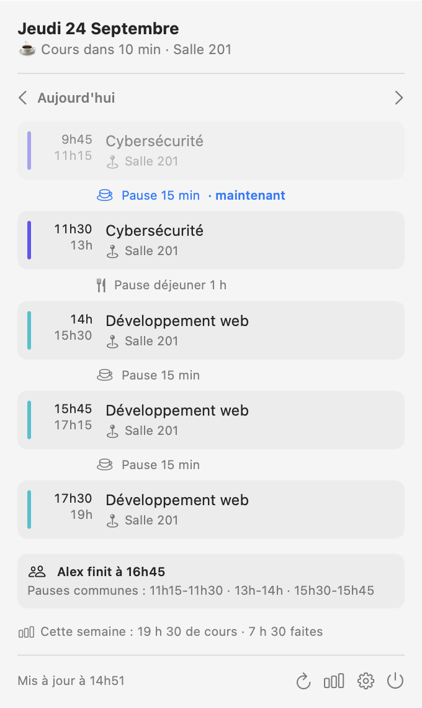
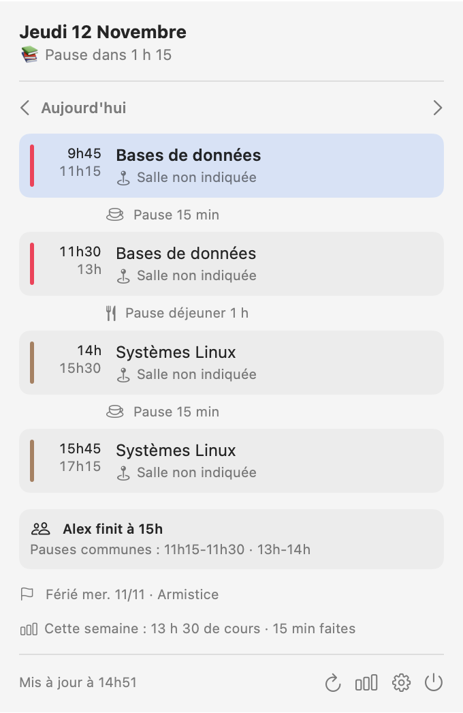
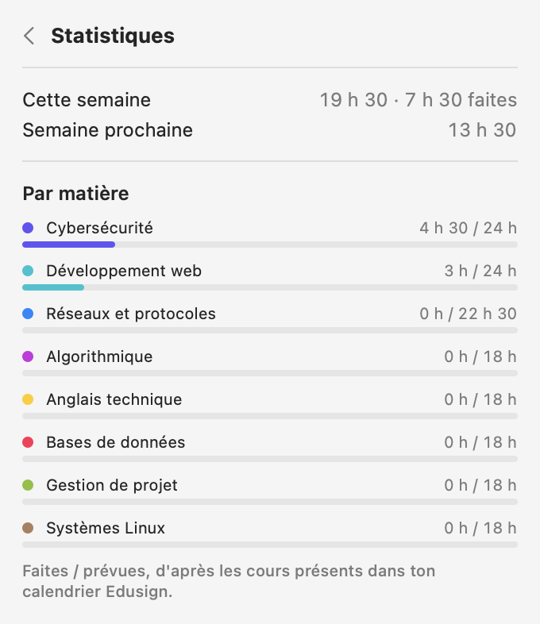
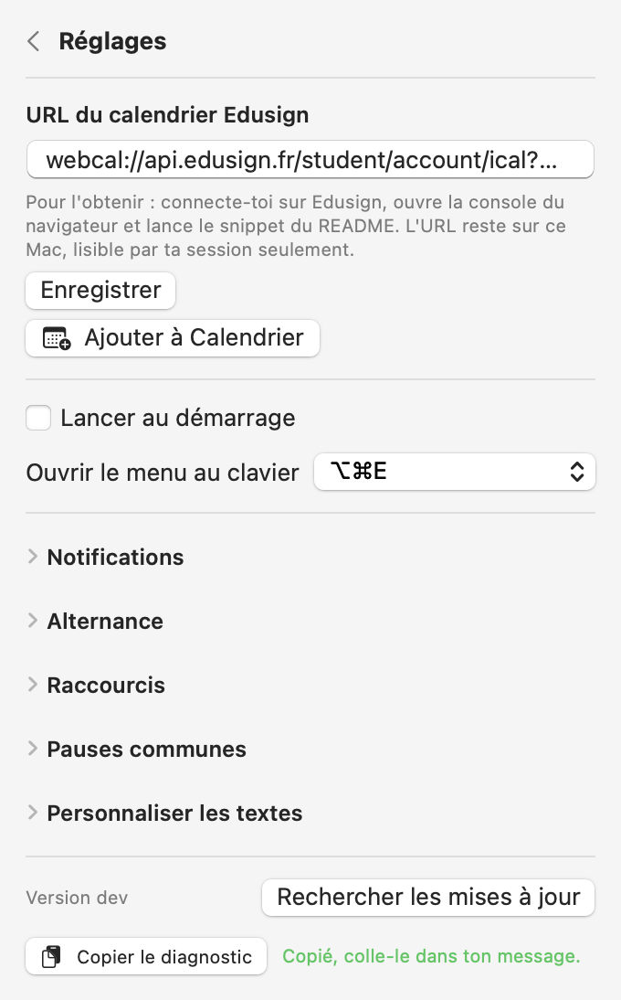
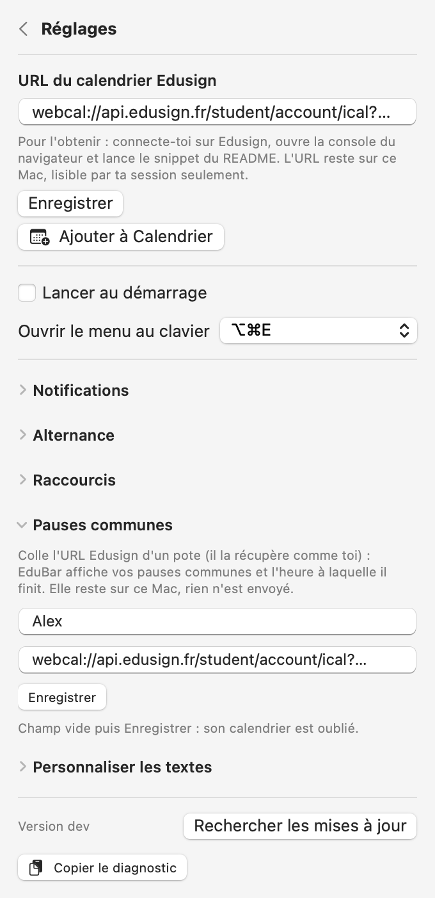

<div align="center" markdown="1">

# EduBar

[](https://github.com/Ailcope/EduBar/releases)
[](https://www.swift.org/)
[](https://www.apple.com/macos/)
[](./LICENSE.md)

**Your Edusign timetable in the macOS menu bar, native Swift, no Xcode.**

Works with **Edusign** &bull; **SwiftUI** &bull; **macOS Notifications**

[🇫🇷 FR](README.md) &bull; **🇬🇧 EN**

</div>

---

## Contents

- [Overview](#overview)
- [Features](#features)
- [Install](#install)
- [Calendar URL](#calendar-url)
- [Configuration](#configuration)
- [Privacy](#privacy)
- [Build](#build)
- [License](#license)
- [Screenshots](#screenshots)

## Overview

**EduBar** is a small macOS menu bar app that reads your Edusign timetable and tells you, at a glance, how long until the next break or class and which room to go to. Click it for the full day, with rooms and breaks. It warns you 15 minutes before a class ends when the next one is in a different room, and sends notifications for class end, class start and room changes. It ships without any calendar URL: you paste yours on first launch, and it stays on your Mac.

## Features

- **Menu bar at a glance.** `📚 Pause dans 23 min` during class, `☕ Cours dans 8 min · 506` on a break, `Demain 9h45` once the day is over.
- **Lunch aware.** A break of one hour or more between 11:00 and 14:00 is shown as lunch: `🍽️ Déjeuner dans 20 min`.
- **Room changes.** 15 minutes before a class ends, if the next one is elsewhere: `⚠️ Salle 501 · fin dans 14 min`.
- **Notifications.** Class end, class start and room change, each with its own toggle, lead time (0 to 60 min), title and text, plus a **Test** button.
- **Timetable changes.** A class cancelled, moved, added or moved to another room within the next two weeks triggers a notification.
- **Next days.** The ‹ › arrows browse the following days (empty weekends are skipped), **Revenir** goes back to today.
- **Exams.** Classes whose title mentions an exam, partiel, DS, contrôle, soutenance, QCM or rattrapage get an orange badge, and the menu bar warns the day before: `📝 Examen demain 9h · 501`.
- **Work-study.** In ⚙️ > **Alternance**: fixed company weekdays, alternating weeks, or automatic detection of days without classes. On those days: `🏢 Entreprise · école Lun. 9h`.
- **Shortcuts.** In ⚙️ > **Raccourcis**, run a Shortcuts shortcut when classes start and when they end.
- **Stats.** Hours this week (done and planned), upcoming exams, progress per subject.
- **Subject colors.** Each subject gets its own color, the same in the day view and in the stats (orange stays for exams).
- **Holidays and breaks.** A gap of 7 days or more shows up under the day: `Vacances dans 12 jours`, then `Vacances · reprise lun. 02/11`. French public holidays of the week are listed to explain the gaps: `Férié mer. 11/11 · Armistice`.
- **Shared breaks.** In ⚙️ > **Pauses communes**, paste a friend's Edusign URL (they get it the same way you do): the day view shows `Alex finit à 15h30` and the breaks you share.
- **Keyboard shortcut.** ⌥⌘E opens and closes the menu from any app, no Accessibility permission needed. Change or disable it in ⚙️.
- **Copy diagnostics.** A button at the bottom of the settings copies the version, app location, quarantine and calendar state for a bug report. Never the URL.
- **Add to Calendar.** One button subscribes the Calendar app to the Edusign feed.
- **Custom texts.** Every menu bar text and emoji can be rewritten, with `{temps}`, `{salle}` and `{jour}` placeholders.
- **Offline.** The timetable is cached locally, so the app keeps working without network.
- **Past days kept.** Edusign drops yesterday from the feed: EduBar archives every past day locally (400 days, 0600), so browsing back and stats stay complete.
- **Updates.** Checks GitHub every 6 hours and installs new releases by itself: verified download (GitHub's SHA-256 digest, bundle id, version and signature), in-place replacement, relaunch. Settings are kept. Clicking the "updated" notification opens the release notes. When run from the `.dmg`, it offers **Installer**: copy, relaunch from Applications and eject the disk image. If it cannot replace itself, a notification announces the new version and links to the download.

## Install

1. Download `EduBar-x.y.z.dmg` (or the `.zip`) from the [Releases](https://github.com/Ailcope/EduBar/releases) and open it.
2. Drag `EduBar.app` onto the `Applications` shortcut, then eject the `.dmg`. Run from the `.dmg`, the app blocks the eject and cannot update itself: the **Installer** button in the menu fixes that.
3. The app is not notarized. On first launch, right-click it and choose **Open**. If macOS says it is damaged:
   ```sh
   xattr -dr com.apple.quarantine /Applications/EduBar.app
   ```
4. Updating from 0.3.2 or older: macOS asks once whether EduBar may read its old Keychain item. Click **Always Allow**, the URL then moves to a file and survives every later update.

Requires macOS 14 or later, Apple Silicon or Intel.

## Calendar URL

1. Log in to Edusign in your browser.
2. Open the console (Cmd+Option+J on Chrome/Brave, Cmd+Option+C on Safari).
3. Paste and run:
   ```js
   const schoolId = JSON.parse(localStorage.getItem('EdusignCampusStorage.school')).id;
   const userId = JSON.parse(localStorage.getItem('EdusignCampusStorage.user')).id;
   console.log(`webcal://api.edusign.fr/student/account/ical?sc=${schoolId}&st=${userId}`);
   ```
4. Copy the `webcal://…` URL, click EduBar, then ⚙️, paste it and hit **Enregistrer**.

## Configuration

Everything lives in ⚙️:

- **Notifications:** three notifications, each with a toggle, a lead time and its own title and text.
- **Personnaliser les textes:** one template per situation (before a break, before lunch, last class, on a break, at lunch, before the first class, room change, day over, exam soon, company day).

| Notification | When (default) | Example |
|---|---|---|
| Class end | 5 min before a run of classes ends | `Fin du cours dans 5 min` · `Langage C avancé se termine à 13h. Ensuite : déjeuner.` |
| Class start | 5 min before the first class or after a break | `Cours dans 5 min · 501` |
| Room change | 15 min before the end, if the next class is elsewhere | `⚠️ Changement de salle : 501` |

Notification placeholders: `{cours}`, `{heure}`, `{temps}`, `{salle}`, `{pause}`. An empty field falls back to the default text. If nothing shows up, allow EduBar in System Settings > Notifications.

## Privacy

The URL is enough to read your timetable: it only holds your school and student IDs, no password. Keep it private. EduBar stores it in `~/Library/Application Support/EduBar/feed-url`, readable by your user only (0600), never writes it to logs, and only talks to `api.edusign.fr` (or the host you give it) and to `api.github.com` for updates, sending nothing but its version. With **Add to Calendar**, the Calendar app then reads the URL itself.

For shared breaks, your friend's URL follows the same rules: they give it to you themselves, it stays in `~/Library/Application Support/EduBar/friend-url` (0600) and their cached timetable never leaves your Mac. Clear the field and hit **Enregistrer** to forget it.

## Build

Command Line Tools only (`xcode-select --install`), no Xcode.

```sh
swift test                 # tests
scripts/bundle.sh 0.1.0    # dist/EduBar.app + .zip + .dmg (universal, ad-hoc signed)
```

## License

[PolyForm Noncommercial 1.0.0](./LICENSE.md) · free to use, modify and share for **noncommercial** purposes. Commercial use or reselling the code requires the author's permission.

## Screenshots

Placeholder subjects, rooms and name (`EduBar --snapshot <folder> --demo`). The app itself is in French.

<table>
<tr>
<td align="center" width="50%">
<picture>
  <source media="(prefers-color-scheme: dark)" srcset="docs/screenshots/day-dark.png">
  
</picture>
<br><sub>The day</sub>
</td>
<td align="center" width="50%">
<picture>
  <source media="(prefers-color-scheme: dark)" srcset="docs/screenshots/holiday-dark.png">
  
</picture>
<br><sub>Public holiday this week</sub>
</td>
</tr>
<tr>
<td align="center">
<picture>
  <source media="(prefers-color-scheme: dark)" srcset="docs/screenshots/stats-dark.png">
  
</picture>
<br><sub>Stats</sub>
</td>
<td align="center">
<picture>
  <source media="(prefers-color-scheme: dark)" srcset="docs/screenshots/settings-dark.png">
  
</picture>
<br><sub>Settings</sub>
</td>
</tr>
<tr>
<td align="center" colspan="2">
<picture>
  <source media="(prefers-color-scheme: dark)" srcset="docs/screenshots/friend-dark.png">
  
</picture>
<br><sub>Shared breaks</sub>
</td>
</tr>
</table>
